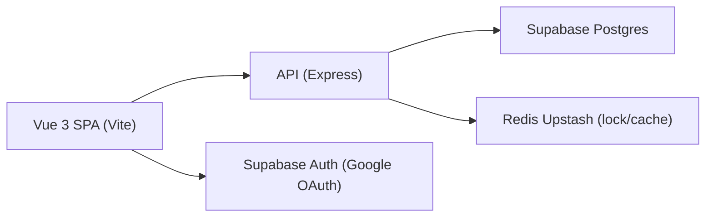

# Technical Architecture – Phase 3 Frontend (Customer)

## 1. Architecture design



## 2. Technology

- Frontend: Vue 3 + Vite + TailwindCSS
- Routing: Vue Router
- State: Pinia (auth/cart/ui)
- Auth: Supabase JS client (Google OAuth) để lấy session + access_token (JWT)
- HTTP: fetch (hoặc axios nếu cần), attach `Authorization: Bearer <access_token>` khi gọi API cần auth

## 3. Route definitions (frontend)

| Route | Mục đích |
|------|----------|
| `/` | Home |
| `/products` | PLP: listing + search/sort |
| `/products/:slug` | PDP |
| `/cart` | Cart page (tối thiểu) |

## 4. API integration (backend đã có)

- Base URL (env): `VITE_API_BASE_URL` (default: `http://localhost:3000/v1`)
- Public:
  - `GET /v1/categories`
  - `GET /v1/products`
  - `GET /v1/products/:slug`
- Auth:
  - `GET /v1/auth/me` (Bearer token Supabase access_token)
- Cart:
  - `GET /v1/cart`
  - `POST /v1/cart/items`
  - `PUT /v1/cart/items/:item_id`
  - `DELETE /v1/cart/items/:item_id`
  - `DELETE /v1/cart`
- Orders:
  - `POST /v1/orders`
  - `GET /v1/orders`
  - `GET /v1/orders/:order_id`
  - `PUT /v1/orders/:order_id/cancel`

## 5. Frontend project structure (đề xuất)

```
frontend/
  index.html
  package.json
  vite.config.ts
  tailwind.config.js
  postcss.config.js
  src/
    main.ts
    app/
      router.ts
      env.ts
      api.ts
      supabase.ts
    stores/
      auth.ts
      cart.ts
      products.ts
      ui.ts
    pages/
      HomePage.vue
      ProductsPage.vue
      ProductDetailPage.vue
      CartPage.vue
    components/
      header/
      nav/
      product/
      cart/
      common/
    styles/
      tailwind.css
      tokens.css
```

## 6. Key implementation notes

- Auth flow:
  - `supabase.auth.signInWithOAuth({ provider: 'google' })`
  - `supabase.auth.getSession()` để lấy `access_token`
  - Lưu token vào Pinia + attach header cho request
- Data fetching:
  - PLP: query `limit/offset/q`, implement infinite scroll hoặc pagination
  - PDP: lấy detail theo `slug`
- UX:
  - Skeleton + error boundary + retry
  - Image lazy loading (native `loading="lazy"`)

