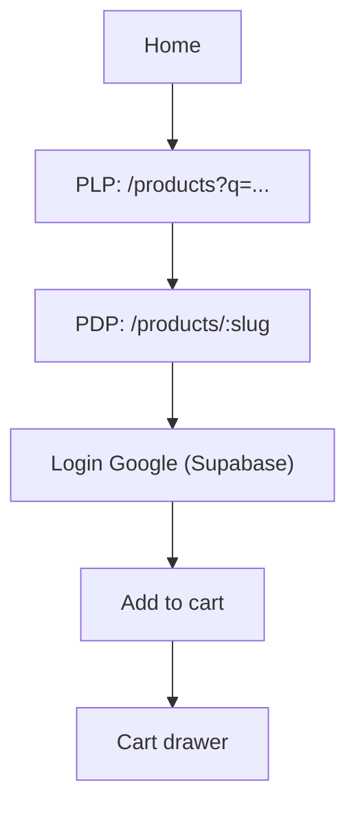

# PRD – Phase 3 Frontend (Customer)

## 1. Tổng quan sản phẩm

Xây dựng giao diện customer (Home → PLP → PDP) theo thiết kế Figma, ưu tiên cảm giác “giống adidas.vn” về bố cục/nhịp thị giác/interaction nhưng không sử dụng asset/nhãn hiệu có bản quyền (logo, hình ảnh sản phẩm thật).

## 2. Tính năng cốt lõi

### 2.1 Vai trò người dùng

| Role | Cách đăng nhập | Quyền chính |
|------|----------------|------------|
| Guest | Chưa đăng nhập | Xem sản phẩm, tìm kiếm, xem chi tiết |
| Customer | Supabase Google OAuth | Thêm giỏ, checkout, xem đơn hàng |

### 2.2 Module tính năng (Phase 3)

1. **Home**: header mega-nav, hero campaign, rail/section sản phẩm, spotlight/banners, footer
2. **PLP (Product Listing)**: listing + sort + filter (tối thiểu search + pagination/infinite), breadcrumb
3. **PDP (Product Detail)**: gallery, giá, mô tả, chọn size/color, add-to-cart, related products
4. **Auth UX**: login Google modal/redirect (tối thiểu để unlock Add-to-cart)
5. **Cart UX**: cart drawer + cart page (tối thiểu drawer) để demo flow

### 2.3 Chi tiết trang

| Trang | Module | Mô tả |
|------|--------|------|
| `/` | Header | Mega menu, search icon, cart badge, user icon |
| `/` | Hero | 1 campaign hero (image + CTA), hỗ trợ responsive crop |
| `/` | Sections | “New arrivals”, “Trending”, rail sản phẩm ẩn/hiện theo breakpoint |
| `/products` | Grid | Grid card sản phẩm, skeleton, lazy image |
| `/products` | Search/Sort | `q`, sort (newest/price) (Phase 3: tối thiểu newest + price) |
| `/products/:slug` | Gallery | Thumbnail strip + main image |
| `/products/:slug` | Variant selector | size/color buttons, hiển thị stock (từ inventory) |
| `/products/:slug` | Add-to-cart | Nếu chưa login → yêu cầu login; nếu login → gọi `/v1/cart/items` |

## 3. Core flow

### 3.1 Home → PLP → PDP

1) User mở Home, click “Nam/Nữ/Trẻ em…” hoặc section CTA  
2) Vào PLP, user search/scroll, click product card  
3) Vào PDP, chọn size/color, add-to-cart  
4) Mở cart drawer, chỉnh qty, checkout (Phase 3: có thể redirect sang trang Cart/Checkout tối giản)

## 4. UI/UX Design

### 4.1 Hướng thiết kế

- **Mục tiêu**: gần Figma, ưu tiên layout, khoảng trắng, kiểu grid, interaction (hover/transition) và cảm giác “retail brand”.
- **Không dùng asset thương hiệu**: logo/ảnh sản phẩm thật/wordmark. Dùng brand placeholder (ví dụ “ADI CLONE”) và ảnh generated từ mock seed.

### 4.2 Typography / Color (đề xuất)

- Headings: font condensed mạnh, cảm giác editorial (ví dụ: Oswald/Barlow Condensed)
- Body: font sans rõ ràng (ví dụ: IBM Plex Sans)
- Palette: nền trắng/đen, accent đơn sắc (đỏ/xanh) theo campaign (lấy từ Figma)

### 4.3 Interaction

- Header hover underline/mega menu open
- Product card hover (swap image / raise shadow / quick add)
- PDP gallery zoom nhẹ + transition thumbnail
- Loading skeleton cho PLP/PDP

### 4.4 Responsive

- Desktop-first theo Figma
- Breakpoints: `sm 640`, `md 768`, `lg 1024`, `xl 1280`, `2xl 1536`
- Mobile: filter chuyển thành drawer, nav thành hamburger

